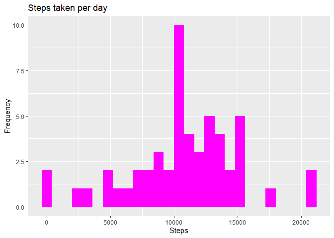
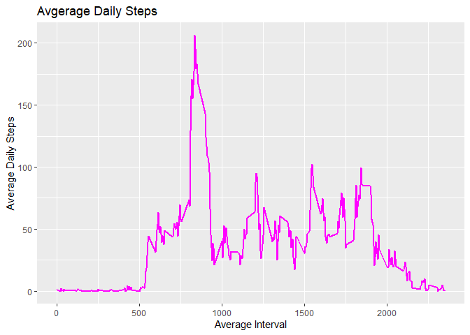
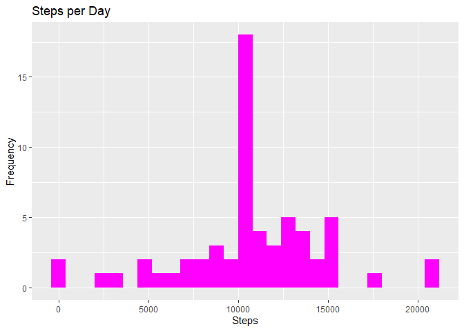
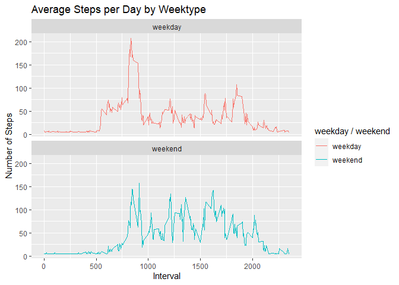

## Loading and preprocessing the data

```r
library("data.table")
library("ggplot2")
```

```
## Warning: package 'ggplot2' was built under R version 3.6.3
```

```r
getwd()
```

```
## [1] "H:/coursera/data-science/part 5/week 2/RepData_PeerAssessment1"
```

```r
unzip("activity.zip")
df <- read.csv("activity.csv")
activity_data <- data.table(df)
```

## What is mean total number of steps taken per day?

```r
all_steps <- activity_data[,lapply(.SD, sum), .SDcols=c("steps"), by = .(date)]
ggplot(all_steps,aes(x=steps))+
  geom_histogram(fill="magenta",binwidth = 800)+
  labs(title ="Steps taken per day",x="Steps",y="Frequency" )
```

```
## Warning: Removed 8 rows containing non-finite values (stat_bin).
```

<!-- -->

```r
all_steps[, .(steps_mean = mean(steps, na.rm = TRUE), steps_median = median(steps, na.rm = TRUE))]
```

```
##    steps_mean steps_median
## 1:   10766.19        10765
```
## What is the average daily activity pattern?

```r
interval_data <- activity_data[, c(lapply(.SD, mean, na.rm = TRUE)), .SDcols = c("steps"), by = .(interval)] 
ggplot(interval_data, aes(x = interval , y = steps)) + geom_line(color="magenta", size=1) + labs(title = "Avgerage Daily Steps", x = "Average Interval", y = "Average Daily Steps")
```

<!-- -->

```r
interval_data[steps == max(steps), .(maximum_interval = interval)]
```

```
##    maximum_interval
## 1:              835
```


## Imputing missing values


```r
nrow(activity_data[is.na(steps),])
```

```
## [1] 2304
```

```r
activity_data[is.na(steps), "steps"] <- activity_data[, c(lapply(.SD, mean, na.rm = TRUE)), .SDcols = c("steps")]
```

```
## Warning in `[<-.data.table`(`*tmp*`, is.na(steps), "steps", value =
## structure(list(: 37.382600 (type 'double') at RHS position 1 truncated
## (precision lost) when assigning to type 'integer' (column 1 named 'steps')
```

```r
data.table::fwrite(x = activity_data, file = "activity_clean.csv", quote = FALSE)
all_steps <- activity_data[, c(lapply(.SD, sum)), .SDcols = c("steps"), by = .(date)] 

all_steps[, .( median_steps = median(steps),mean_steps = mean(steps))]
```

```
##    median_steps mean_steps
## 1:        10656   10751.74
```

```r
ggplot(all_steps, aes(x = steps)) + geom_histogram(binwidth = 800,fill = "magenta") + labs(title = "Steps per Day", x = "Steps", y = "Frequency")
```

<!-- -->

## Are there differences in activity patterns between weekdays and weekends?

```r
activity_data[, date := as.POSIXct(date, format = "%Y-%m-%d")]
activity_data[, `Week Day`:= weekdays(x = date)]
activity_data[grepl(pattern = "Monday|Tuesday|Wednesday|Thursday|Friday", x = `Week Day`), "weekday / weekend"] <- "weekday"
activity_data[grepl(pattern = "Saturday|Sunday", x = `Week Day`),"weekday / weekend"] <- "weekend"
activity_data[, `weekday / weekend` := as.factor(`weekday / weekend`)]

activity_data[is.na(steps), "steps"] <- activity_data[, c(lapply(.SD, median, na.rm = TRUE)), .SDcols = c("steps")]
interval_data <- activity_data[, c(lapply(.SD, mean, na.rm = TRUE)), .SDcols = c("steps"), by = .(interval, `weekday / weekend`)] 
ggplot(interval_data , aes(x = interval , y = steps, color=`weekday / weekend`)) + geom_line() + labs(title = "Average Steps per Day by Weektype", x = "Interval", y = "Number of Steps") + facet_wrap(~`weekday / weekend` , ncol = 1, nrow=2)
```

<!-- -->
